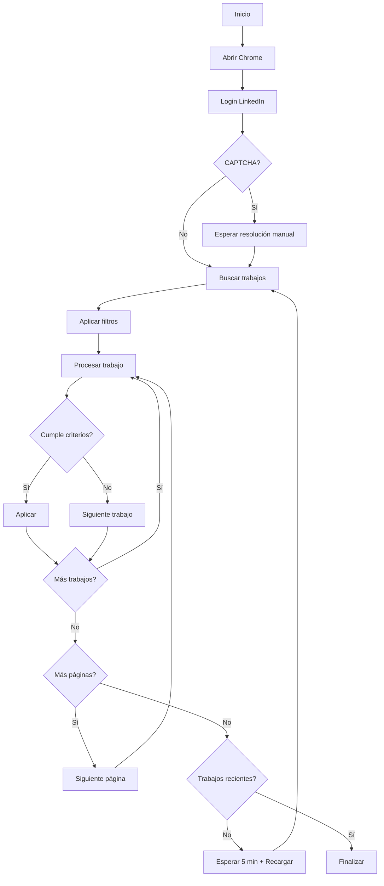

# 🚀 Bot Profesional para Aplicar a Empleos en LinkedIn

Un bot de automatización avanzada para aplicar automáticamente a trabajos en LinkedIn usando Puppeteer y Node.js. Este sistema inteligente incluye filtrado por palabras clave, detección de trabajos recientes, y funcionalidad de recarga automática para maximizar las oportunidades de aplicación.

## 📋 Tabla de Contenidos

- [Características](#-características)
- [Tecnologías Utilizadas](#-tecnologías-utilizadas)
- [Instalación](#-instalación)
- [Configuración](#-configuración)
- [Uso](#-uso)
- [Flujo del Proyecto](#-flujo-del-proyecto)
- [Funciones Principales](#-funciones-principales)
- [Configuración Avanzada](#-configuración-avanzada)
- [Solución de Problemas](#-solución-de-problemas)
- [Contribución](#-contribución)
- [Licencia](#-licencia)

## ✨ Características

### 🎯 **Filtrado Inteligente**
- **Palabras clave requeridas (fullKeys):** Solo aplica a trabajos que contengan términos específicos en el título
- **Palabras clave prohibidas (badKeys):** Evita trabajos con tecnologías no deseadas
- **Detección de trabajos recientes:** Prioriza trabajos publicados en minutos/horas para ser de los primeros aplicantes

### 🔄 **Automatización Avanzada**
- **Recarga automática:** Cuando no hay más trabajos recientes, espera 5 minutos y recarga la primera página
- **Detección de aplicaciones previas:** Evita aplicar dos veces al mismo trabajo
- **Trabajos externos:** Identifica y omite trabajos que redirigen fuera de LinkedIn
- **Manejo de CAPTCHA:** Detección automática y pausa para resolución manual
- **Alertas sonoras:** Sistema de notificación con 6 bips cuando se requiere intervención manual
- **Detección de modal de descarte:** Identifica automáticamente cuando el bot no puede llenar formularios

### 📝 **Llenado de Formularios**
- **Campos de experiencia:** Llenado automático con años configurables
- **Radio buttons:** Selección automática de "YES/SÍ"
- **Selects:** Configuración inteligente 
- **Expectativa salarial:** Valor predefinido configurable
- **Manejo de caracteres especiales:** Escape automático de caracteres regex en badKeys (c++, .net, etc.)
- **Intervención manual:** Detección automática de formularios complejos con alerta sonora

### 📊 **Escalabilidad**
- **Hasta 32 aplicaciones por día:** 14 páginas × 25 ofertas por sesión
- **Paginación robusta:** Navegación automática entre páginas de resultados
- **Logging detallado:** Seguimiento completo del proceso para debugging

## 🛠 Tecnologías Utilizadas

- **[Node.js](https://nodejs.org/)** - Runtime de JavaScript
- **[Puppeteer](https://pptr.dev/)** v17.1.3 - Automatización del navegador Chrome
- **[Nodemon](https://nodemon.io/)** v2.0.22 - Herramienta de desarrollo
- **Chrome/Chromium** - Navegador para automatización

## 📦 Instalación

### Prerrequisitos

- Node.js (versión 14 o superior)
- Google Chrome instalado
- Cuenta de LinkedIn activa

### Pasos de Instalación

1. **Clonar el repositorio:**
```bash
git clone https://github.com/adnanedrief/linkedin-job-apply-automation.git
cd linkedin-job-apply-automation
```

2. **Instalar dependencias:**
```bash
npm install
```

3. **Verificar la ruta de Chrome:**
   - Windows: `C:\Program Files\Google\Chrome\Application\chrome.exe`
   - macOS: `/Applications/Google Chrome.app/Contents/MacOS/Google Chrome`
   - Linux: `/usr/bin/google-chrome`

## ⚙️ Configuración

### Archivo `config.json`

Configura todos los parámetros del bot en el archivo `config.json`:

```json
{
    "email": "tu-email@gmail.com",
    "password": "tu-contraseña",
    "ChromePath": "C:\\Program Files\\Google Chrome\\Application\\chrome.exe",
    "keyword": "Developer",
    "location": "España",
    "Period": "Last Week",
    "AvgExperience": 5,
    "resolution": "--window-size=1300,700",
    "baseURL": "https://www.linkedin.com/login",
    "numberOfPagination": 14,
    "numberOfOffersPerPage": 25,
    "fullKeys": "laravel, wordpress, fullstack, react, vue, node, php, frontend, backend, desarrollador",
    "badKeys": ".net, java, devops, swift"
}
```

### Parámetros de Configuración

| Parámetro | Descripción | Ejemplo |
|-----------|-------------|---------|
| `email` | Email de LinkedIn | `"usuario@gmail.com"` |
| `password` | Contraseña de LinkedIn | `"MiContraseña123"` |
| `ChromePath` | Ruta del ejecutable de Chrome | `"C:\\Program Files\\Google Chrome\\Application\\chrome.exe"` |
| `keyword` | Término de búsqueda principal | `"Developer"` |
| `location` | Ubicación de búsqueda | `"España"` |
| `Period` | Período de tiempo | `"Last Week"` o `"Past 24 hours"` |
| `AvgExperience` | Años de experiencia para formularios | `5` |
| `numberOfPagination` | Número de páginas a procesar | `14` (máx 32 aplicaciones, limite de Linkedin) |
| `fullKeys` | Palabras clave requeridas (separadas por comas) | `"react, node, php"` |
| `badKeys` | Palabras clave a evitar (separadas por comas) | `"java, .net"` |

## 🚀 Uso

### Ejecución Básica

```bash
node index.js
```

### Ejecución con Nodemon (Desarrollo)

```bash
npx nodemon index.js
```

### Proceso de Ejecución

1. **Inicio:** El bot abre Chrome y navega a LinkedIn
2. **Login:** Ingresa credenciales automáticamente
3. **CAPTCHA:** Si aparece, pausa para resolución manual
4. **Búsqueda:** Aplica filtros y busca trabajos
5. **Aplicación:** Procesa cada trabajo según los criterios configurados
6. **Recarga:** Si no hay trabajos recientes, espera 5 minutos y recarga

## 🔄 Flujo del Proyecto



## 🔧 Funciones Principales

### Core Functions

#### `initiliazer()`
- Lanza Chrome con configuración específica
- Configura logging de consola
- Establece viewport y parámetros del navegador

#### `Login()`
- Automatiza el proceso de login
- Maneja detección de CAPTCHA
- Espera redirección al feed

#### `waitForCaptcha()`
- Detecta iframe de CAPTCHA
- Pausa ejecución para resolución manual
- Continúa automáticamente tras resolución

#### `jobsApply()`
- Navega a sección de trabajos
- Aplica filtros de búsqueda
- Inicia proceso de aplicación masiva

### Filtrado y Validación

#### `checkJobTitleKeywords(jobSelector)`
- Extrae título del trabajo
- Verifica coincidencias con `fullKeys`
- Retorna `true` si encuentra palabras clave requeridas

#### `checkBadKeywords(jobSelector)`
- Verifica `badKeys` en título y descripción
- **Escape de caracteres especiales:** Maneja automáticamente caracteres como +, *, ?, ^, $, {}, (), |, [], \ en badKeys
- Retorna `true` si encuentra palabras prohibidas

### Automatización de Formularios

#### `fillFormFields()`
- **Campos de experiencia:** Llena con valor de `AvgExperience`
- **Radio buttons:** Selecciona automáticamente "YES/SÍ"
- **Selects:** Configura con "SI/YES" (excepto códigos de país)
- **Expectativa salarial:** Llena con valor predefinido (1200)
- **Detección de modal:** Llama automáticamente a `detectDiscardModal()` después del llenado

#### `detectDiscardModal()`
- **Detección automática:** Busca modal con `data-test-modal-id="data-test-easy-apply-discard-confirmation"`
- **Alerta sonora:** Reproduce 6 bips consecutivos de 800Hz cuando detecta intervención manual requerida
- **Logging detallado:** Registra cuando se requiere intervención del usuario
- **Configuración de sonido:** Bips de 0.2s con pausas de 0.15s entre cada uno

### Navegación y Paginación

#### `handlePagination()`
- Detecta página actual
- Navega a siguiente página disponible
- Verifica carga correcta de nueva página

#### `Scrolling()`
- Hace scroll inteligente en lista de trabajos
- Múltiples selectores de respaldo
- Adaptación a cambios de LinkedIn

## ⚙️ Configuración Avanzada

### Personalización de Filtros

#### FullKeys (Palabras Clave Requeridas)
```json
"fullKeys": "laravel, wordpress, fullstack, react, vue, node, php, frontend, backend, desarrollador, programador, developer"
```

#### BadKeys (Palabras Clave Prohibidas)
```json
"badKeys": ".net, java, devops, swift, python, django, c++, c#"
```

**Nota:** El sistema maneja automáticamente caracteres especiales como `c++`, `.net`, `c#` escapando los caracteres regex apropiadamente.

### Configuración de Recarga Automática

En `index.js`, línea 25:
```javascript
const ENABLE_AUTO_RELOAD = true // Cambiar a false para deshabilitar
```

### Configuración de Alertas Sonoras

Las alertas sonoras se configuran automáticamente en la función `detectDiscardModal()`:

```javascript
// Parámetros de sonido configurables:
const beepDuration = 0.2;     // Duración de cada bip (segundos)
const pauseDuration = 0.15;   // Pausa entre bips (segundos)
const numberOfBeeps = 6;      // Cantidad de bips (actual: 6)
const frequency = 800;        // Frecuencia del sonido (Hz)
```

## 🐛 Solución de Problemas

### Problemas Comunes

#### 1. **Chrome no se abre**
```bash
Error: Failed to launch the browser process
```
**Solución:** Verificar la ruta de Chrome en `config.json`

#### 2. **CAPTCHA frecuente**
**Solución:** 
- Usar cuenta de LinkedIn establecida
- Evitar múltiples ejecuciones seguidas
- Considerar usar `userDataDir` para mantener sesión

#### 3. **Selectores no funcionan**
**Solución:** LinkedIn cambia frecuentemente su HTML. Verificar logs de consola y actualizar selectores si es necesario.

#### 4. **Bot se detiene en paginación**
**Solución:** Verificar que hay suficientes páginas de resultados para el número configurado en `numberOfPagination`

#### 5. **Error con badKeys que contienen caracteres especiales**
```bash
Error: Invalid regular expression: /\bc++\b/i: Nothing to repeat
```
**Solución:** El sistema ahora escapa automáticamente caracteres especiales en badKeys. Puedes usar términos como "c++", ".net", "c#" sin problemas.

#### 6. **No escucho las alertas sonoras**
**Solución:** 
- Verificar que el navegador tiene permisos de audio
- Comprobar que el volumen del sistema esté activado
- Las alertas solo suenan cuando aparece el modal de descarte específico

## 📊 Estadísticas del Proyecto

- **Capacidad máxima:** 32 aplicaciones por día
- **Filtrado inteligente:** 2 niveles (fullKeys + badKeys)
- **Detección automática:** Trabajos aplicados, externos, y recientes
- **Robustez:** Múltiples selectores de respaldo para cada acción
- **Escalabilidad:** Configuración flexible para diferentes necesidades
- **Alertas inteligentes:** Sistema de notificación sonora con 6 bips para intervención manual
- **Compatibilidad regex:** Manejo automático de caracteres especiales en filtros
- **Líneas de código:** 1297 líneas con funcionalidades avanzadas

## 🔒 Consideraciones de Seguridad

### Mejores Prácticas

1. **Credenciales:** Nunca commitear credenciales reales al repositorio
2. **Límites de uso:** Respetar términos de servicio de LinkedIn
3. **Frecuencia:** Evitar uso excesivo para prevenir bloqueos de cuenta
4. **Datos personales:** Mantener información personal segura

### Variables de Entorno (Recomendado)

```javascript
// Alternativa segura para credenciales
const email = process.env.LINKEDIN_EMAIL || data.email;
const password = process.env.LINKEDIN_PASSWORD || data.password;
```

## 🤝 Contribución

### Cómo Contribuir

1. Fork del repositorio
2. Crear rama para nueva funcionalidad (`git checkout -b feature/nueva-funcionalidad`)
3. Commit de cambios (`git commit -am 'Agregar nueva funcionalidad'`)
4. Push a la rama (`git push origin feature/nueva-funcionalidad`)
5. Crear Pull Request

### Áreas de Mejora

- [ ] Integración con bases de datos para tracking
- [ ] Interfaz web para configuración
- [ ] Soporte para múltiples cuentas
- [ ] Análisis de éxito de aplicaciones
- [ ] Integración con APIs de LinkedIn

## 📝 Licencia

Este proyecto está bajo la Licencia MIT. Ver el archivo [LICENSE](LICENSE) para más detalles.

---

## 👨‍💻 Autor

- 👨‍💻 **Ing. Edward Avalos** - *Full Stack Developer y Desarrollador Principal* - [GitHub](https://github.com/kirusiya/) | [LinkedIn](https://www.linkedin.com/in/edward-avalos-severiche/)
- 📧 **Email**: edward@ajamba.org
- 📱 **WhatsApp Business**: (+591) 61781119 | [Whatsapp](https://wa.me/59161781119)


## ⚠️ Disclaimer

Este bot está diseñado para uso educativo y de automatización personal. Los usuarios son responsables de cumplir con los términos de servicio de LinkedIn y usar la herramienta de manera ética y responsable.

**Nota:** LinkedIn puede cambiar su estructura HTML en cualquier momento, lo que podría requerir actualizaciones en los selectores del bot.
